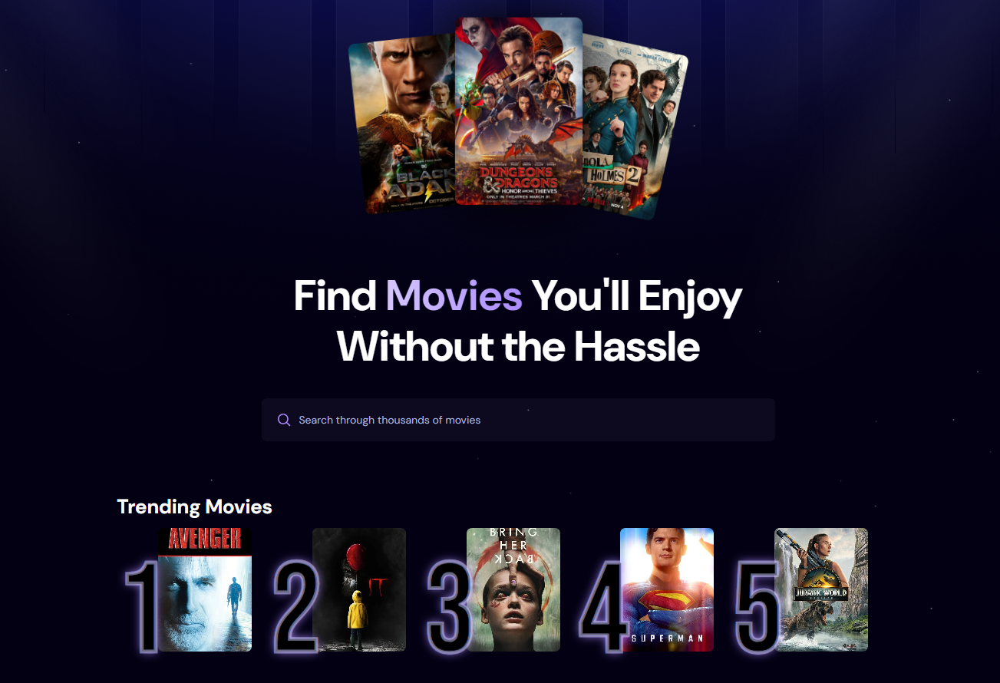
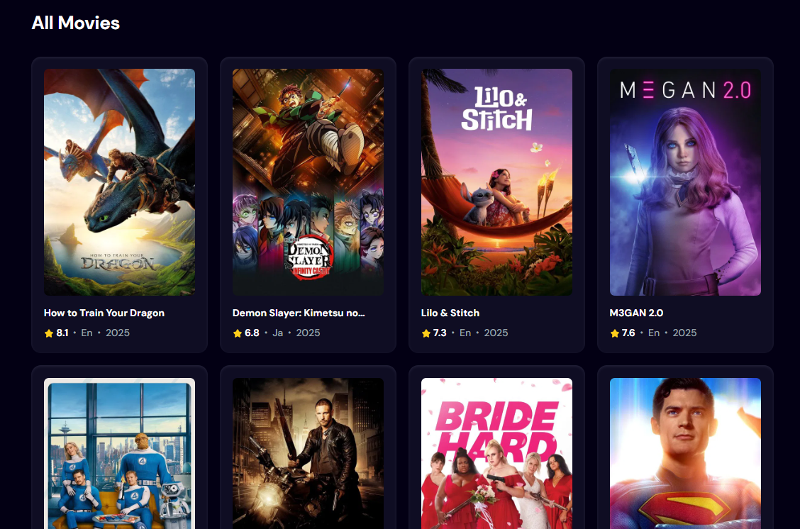
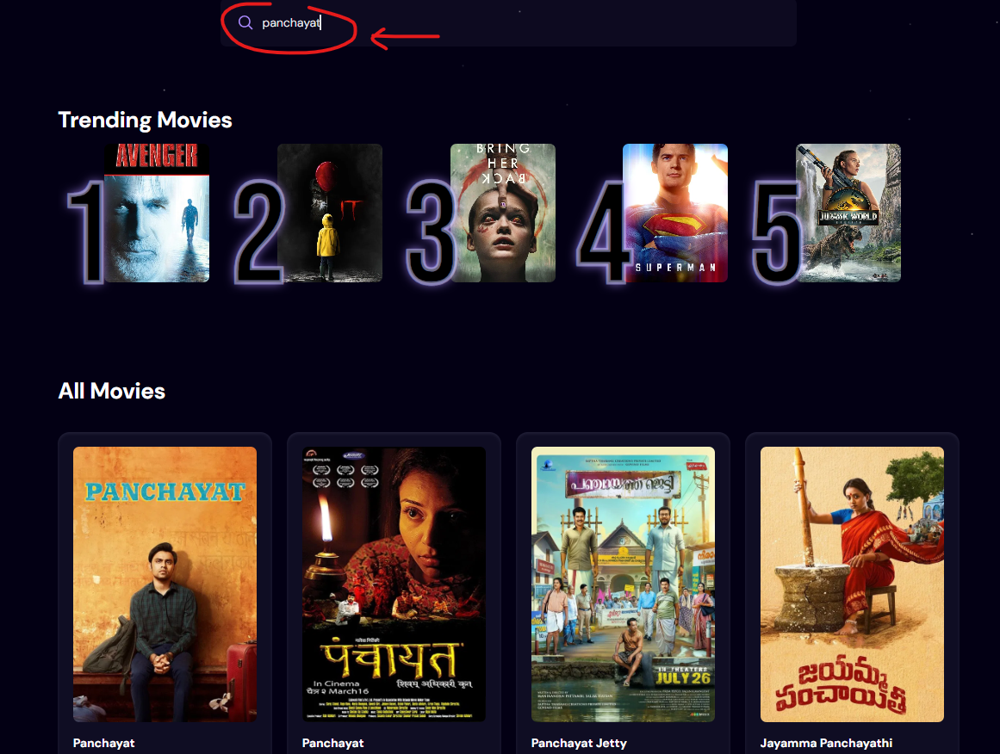
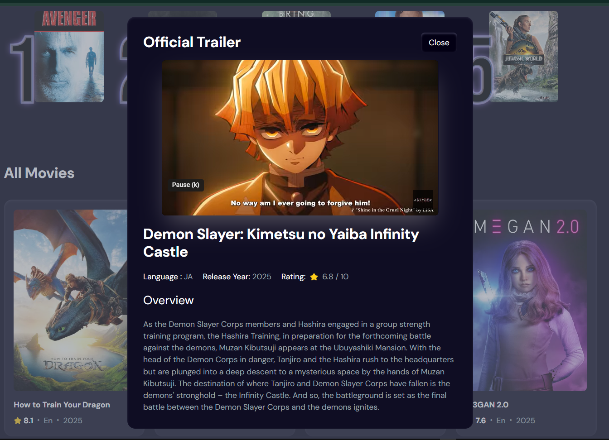

# 🎬 MovieInfo

Discover trending and popular movies with ease!  
MovieInfo is a modern React app built with Vite and Tailwind CSS, featuring live search, trending analytics, and beautiful UI.

<p align="center">
  
</p>

## 🚀 Features

- 🔍 **Instant Movie Search** – Search thousands of movies from TMDB with live search functionality.
- 📈 **Trending Movies Based on User Views and Searches** – Discover trending movies powered by user search analytics and views using the TMDB API.
- 🎞️ **Comprehensive Movie Information Page** – View detailed movie information including ratings, languages, release years, and watch official trailers.
- ⚡ **Fast & Responsive UI** – Built with React 19, Vite, and Tailwind CSS for a smooth and responsive user experience.
- ☁️ **Appwrite Integration** – Tracks search analytics and trending movies to provide real-time insights.

---

## 📸 Screenshots
### Home

### Popular movies

### Search Results

### Movie Info


---

## 🛠️ Tech Stack

- [React](https://react.dev/)
- [Vite](https://vitejs.dev/)
- [Tailwind CSS](https://tailwindcss.com/)
- [Appwrite](https://appwrite.io/)
- [TMDB API](https://www.themoviedb.org/documentation/api)

---

## ⚙️ Getting Started

### 1. Clone the repository

```sh
git clone https://github.com/abhi24112/Movie-Website.git
```

### 2. Install dependencies

```sh
npm install
```

### 3. Set up environment variables

Create a `.env.local` file in the root directory and add:

```env
VITE_TMDB_API_KEY=your_tmdb_api_key
VITE_APPWRITE_PROJECT_ID=your_appwrite_project_id
VITE_APPWRITE_DATABASE_ID=your_appwrite_database_id
VITE_APPWRITE_COLLECTION_ID=your_appwrite_collection_id
VITE_APPWRITE_ENDPOINT=your_appwrite_endpoint
```

### 4. Start the development server

```sh
npm run dev
```

Visit [http://localhost:5173](http://localhost:5173) to view the app.

---

## 📝 Project Structure

```
MovieWebsite/
├── public/
├── src/
│   ├── assets/
│   ├── components/
│   │   ├── MovieCard.jsx
│   │   ├── MovieInfo.jsx
│   │   ├── Search.jsx
│   │   └── Spinner.jsx
│   ├── App.jsx
│   ├── appwrite.js
│   ├── index.css
│   └── main.jsx
├── .env.local
├── package.json
├── vite.config.js
└── README.md
```

---

## 🙏 Credits

- Movie data from [TMDB](https://www.themoviedb.org/)
- UI inspired by modern streaming platforms

---

## 📄 License

This project is licensed under the MIT License.

---

>
